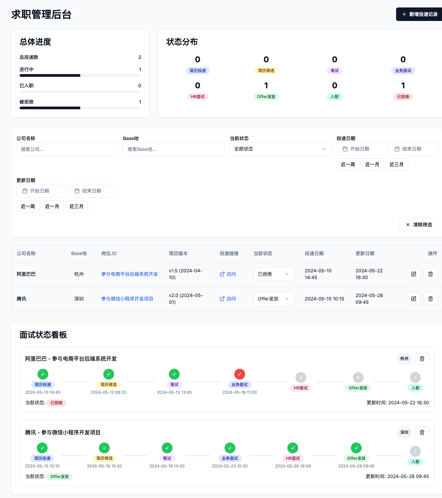

# 简历投递管理器

> 打造一个专为应届毕业生设计的求职管理系统，旨在解决求职过程中简历投递混乱、进度跟踪困难的核心痛点


# 效果图




# 部署说明

## Node.js 部署

### 环境要求

- Node.js 18.x 或更高版本
- npm 或 yarn 包管理器

### 部署步骤

1. 克隆项目代码到服务器：

   ```bash
   git clone https://github.com/lthero-big/JobApplyManagement
   cd JobApplyManagement
   ```

2. 安装依赖：

   ```bash
   npm install
   ```

3. 构建生产版本：

   ```bash
   npm run build
   ```

4. 启动生产服务器：

   ```bash
   npm run preview
   ```

   默认情况下，应用将在 `http://localhost:8080` 上运行。

### 环境变量配置

在生产环境中，可以通过设置以下环境变量来配置应用：

- `NODE_ENV`: 设置为 `production`
- `PORT`: 应用监听的端口（默认 8080）

### 使用 PM2 进行进程管理（推荐）

1. 安装 PM2：

   ```bash
   npm install -g pm2
   ```

2. 启动应用：

   ```bash
   pm2 start npm --name "job-tracker" -- run preview
   ```

3. 设置开机自启：

   ```bash
   pm2 startup
   pm2 save
   ```

## Docker 部署

### 环境要求

- Docker
- Docker Compose

### 部署步骤

1. 克隆项目代码到本地：

   ```bash
   git clone https://github.com/lthero-big/JobApplyManagement
   cd JobApplyManagement
   ```

2. 构建并启动 Docker 容器：

   ```bash
   docker compose up -d
   ```

3. 等待服务启动完成，访问应用：

   - 前端应用: http://localhost:8080
   - 数据库管理: http://localhost:5432 (PostgreSQL)

### 数据库初始化

数据库表会在首次启动时自动创建。如果需要手动初始化数据库，可以运行：

```bash
docker compose exec db psql -U postgres -d job_applications_db -f /docker-entrypoint-initdb.d/init-db.sh
```

### 停止服务

```bash
docker compose down
```

### 查看日志

```bash
# 查看应用日志
docker-compose logs app

# 查看数据库日志
docker-compose logs db
```

## 环境变量配置

可以在 `docker-compose.yml` 文件中修改以下环境变量：

- `POSTGRES_DB`: 数据库名称
- `POSTGRES_USER`: 数据库用户名
- `POSTGRES_PASSWORD`: 数据库密码

## 数据持久化

数据库数据存储在 Docker 卷中，即使容器被删除，数据也会保留。可以通过以下命令查看卷：

```bash
docker volume ls
```

## 故障排除

1. 如果端口冲突，请修改 `docker-compose.yml` 中的端口映射
2. 如果数据库连接失败，请检查环境变量配置
3. 如果应用无法启动，请查看日志以获取详细错误信息

## 使用本地 Supabase

如果你想在本地运行 Supabase（开发环境），参见 `LOCAL_SUPABASE_SETUP.md` 获取详细步骤，或运行 `npm run supabase:start` 来启动本地 Supabase（需要安装 Supabase CLI）。

也可以使用本仓库提供的 Docker Compose 文件一键启动一个开发用的 Supabase stack：

1. 复制示例 env 文件并调整：

```bash
cp .env.supabase.example .env.supabase
# 编辑 .env.supabase，确保端口/密码等设置符合你的需求
```

2. 启动 Docker Supabase stack：

```bash
npm run docker:supabase:up
```

3. 停止并清理：

```bash
npm run docker:supabase:down
```

Adminer (数据库 GUI) 会在 `http://localhost:8081` 可用，连接到 `db` 服务（Postgres 默认端口 5432 / 在宿主机上映射为 54321）。

注意：某些 Supabase 相关镜像（例如 `supabase/gotrue:latest`）在 Docker Hub 并不总是存在或可用，直接 `docker compose up` 可能会因为找不到镜像 manifest 而失败，出现类似：

```
manifest for supabase/gotrue:latest not found: manifest unknown
```

解决办法：

- 推荐（开发）：使用 Supabase CLI（`supabase start`），它会自动拉取并配置本地开发所需的组件；或者使用官方 self-host 指南得到稳定镜像标签。
- 若使用本仓库的 `docker-compose.yml`，将 Supabase 子服务设为可选 profile：

```bash
# 启动仅 app + db（默认）
docker compose up -d

# 启动 app + db + supabase profile 中的服务
docker compose --profile supabase up -d
```

或者在 `package.json` 中使用封装脚本：

```bash
npm run docker:supabase:up
```

如果你想让我把所有 Supabase 镜像替换为已知的固定 tag（并添加重试/健康检查），我可以替你把 `latest` 替换为稳定 tag 并验证可用性。
